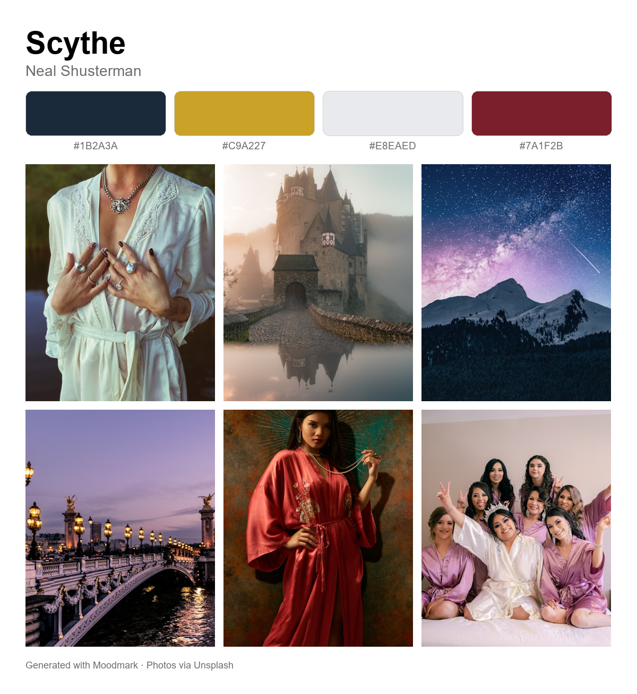

# 📚 Moodmark 🔖

**Turn any book into a visual mood board — its color palette, aesthetics, and curated photos, plus similar reads to explore.**

Enter a book title and Moodmark "reads" it, then captures its atmosphere as a color
palette, aesthetic keywords, an essence-capturing quote, and a wall of real photos —
all downloadable as a single shareable image. It even recommends books with a similar
vibe that you can click to explore.



> _Above: the downloadable image Moodmark composes (palette + photos). For a peek at the live app UI, run it locally — see Setup._

## ✨ Features

- 🎨 **Color palette** — the 4 colors most relevant to the book's themes, each with the reasoning behind it
- 🏷️ **Aesthetics** — evocative style tags (e.g. "dark academia", "clinical futurism")
- 🖼️ **Curated photos** — 6 real Unsplash images that match the story's vibe (with photographer credit)
- 📖 **Real cover & year** — pulled automatically from Open Library
- 💬 **Essence quote** — a short line that sums up the spirit of the story
- ⬇️ **One-click download** — the whole board composed into a single shareable PNG
- 🔗 **Explore similar reads** — click a recommendation to open a panel with its cover, description, and its own palette

## 🛠️ How it works

Three sources behind a [Streamlit](https://streamlit.io) interface:

1. **Claude** (`claude-sonnet-4-6`) reads the book and returns a structured mood-board
   concept — vibe, quote, hex palette, aesthetic tags, photo search queries, and
   similar-book recommendations.
2. **Unsplash** turns those search queries into real Pinterest-style photos.
3. **Open Library** (no API key needed) supplies real book covers and publish years.

Claude only produces text, so the visuals come from Unsplash and Open Library — that
split is the whole architecture.

## 🚀 Setup

### 1. Get two API keys (both free to start)

- **Anthropic** (for Claude): https://console.anthropic.com
- **Unsplash** (for photos): https://unsplash.com/developers — register an app and copy the **Access Key**.

### 2. Install dependencies

```powershell
python -m venv .venv
.\.venv\Scripts\Activate.ps1
pip install -r requirements.txt
```

### 3. Add your keys

Copy `.streamlit/secrets.toml.example` to `.streamlit/secrets.toml` and fill in your keys:

```toml
ANTHROPIC_API_KEY = "sk-ant-..."
UNSPLASH_ACCESS_KEY = "your-unsplash-access-key"
```

`secrets.toml` is git-ignored, so your keys never get committed.

### 4. Run it

```powershell
streamlit run app.py
```

Your browser opens to the app. Type a book title (try `Scythe`) and hit **✨ Generate mood board**.

## 🧰 Tech stack

Python · Streamlit · Anthropic Claude API · Unsplash API · Open Library API · Pillow

## 💡 Notes & costs

- Results are **cached to disk**, so a book (or recommendation) you've already generated is never re-paid for — even across restarts.
- Each new board is roughly a few cents on Claude; recommendation detail panels are a small extra call, generated only when you click.
- Unsplash's free Demo tier allows **50 requests/hour**. Moodmark fetches at most 6 photos per board to stay well under that.

## 🌱 Ideas for later

- "Set the mood" pairings (drink, scent, setting) and a soundtrack
- A vibe radar chart across mood dimensions
- Wallpaper-sized exports
- Bring-your-own-key mode for public deployment
